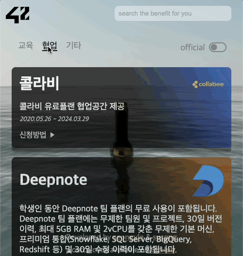

<br />
<div align="center">
  <a href="https://github.com/42Benefit/benefit">
    
  </a>

  <h3 align="center">42 Benefit</h3>

  <p align="center">
    explore the galaxy with benefits!
    <br />
    <br />
    <a href="https://benefit.42seoul.link/">Visit Site</a>
    ·
    <a href="https://github.com/42Benefit/benefit/issues">Report Bug</a>
    ·
    <a href="https://github.com/42Benefit/benefit/issues">Request Feature</a>
  </p>
</div>

## 프로젝트 소개

benefit는 42서울 카뎃들을 위한 혜택들을 모아놓은 사이트입니다.

제휴기업들이 `은하수를 여행하고 있는 히치하치하이커`들에게 제공하는 혜택과 이용밥법을 참고해보세요!

### 컨퍼런스 비디오
[conference video](http://www.youtube.com/watch?v=VDQbgno9Zw8)

### 광고

| [](http://www.youtube.com/watch?v=Oi8xf-m5zAo) | [](http://www.youtube.com/watch?v=-HCu_mi_mmk)|
| :--: | :--: |

### OverView
| | |  | |
| :--: | :--: | :--: | :--: |
| mobile overview | web overview | typing effect | mouse effect |
### 기술 스택


 

---


## 라이센스

이 프로젝트는 MIT 라이선스를 따릅니다. 자세한 내용은 [LICENSE](LICENSE) 파일을 참조하십시오. 

rollthebryce에 의해 만들어진 [Message in a Bottle](https://skfb.ly/6YYwn)는 [Creative Commons Attribution](http://creativecommons.org/licenses/by/4.0/)을 따르고 있습니다.

## 개발자
|||| 
|:-:|:-:| :--: |
|[seongyle](https://github.com/YeonSeong-Lee)|[susong](https://github.com/SeungWoonSong)|[youkim](https://github.com/scarf005) |


## 기여 방법

1. 저장소를 포크합니다.
2. 새로운 브랜치를 만들어 작업을 진행합니다.
3. 작업이 완료되면 풀 리퀘스트를 생성합니다.
4. 코드 리뷰를 기다린 후, 변경 사항이 승인되면 브랜치가 병합됩니다.

### 베네핏을 추가하거나 수정하고 싶어요.

`src/data/student.json`를 수정후에 PR날려주세요. PR시 아래와 같이 데이터형식을 지켜주세요.

```
{
        "companyName": "GitHub",
        "companyDescription": "GitHub는 강력한 협업, 코드 검토 및 코드 관리 기능을 제공합니다.",
        "logo": "base64로 인코딩된 이미지파일 없다면 생략",
        "category": "교육",
        "content": "학생인 동안 무료로 GitHub Pro를 사용하세요.",
        "method": [
            "GitHub 웹사이트에서 바로 접근",
            "GitHub 지원에서 도움 받기"
        ],
        "startDate": "YYYY.MM.DD", (없으면 빈문자열)
        "endDate": "YYYY.MM.DD" (없으면 빈문자열)
    },
```

## 기여자

<a href="https://github.com/42Benefit/benefit/graphs/contributors">
  
</a>
